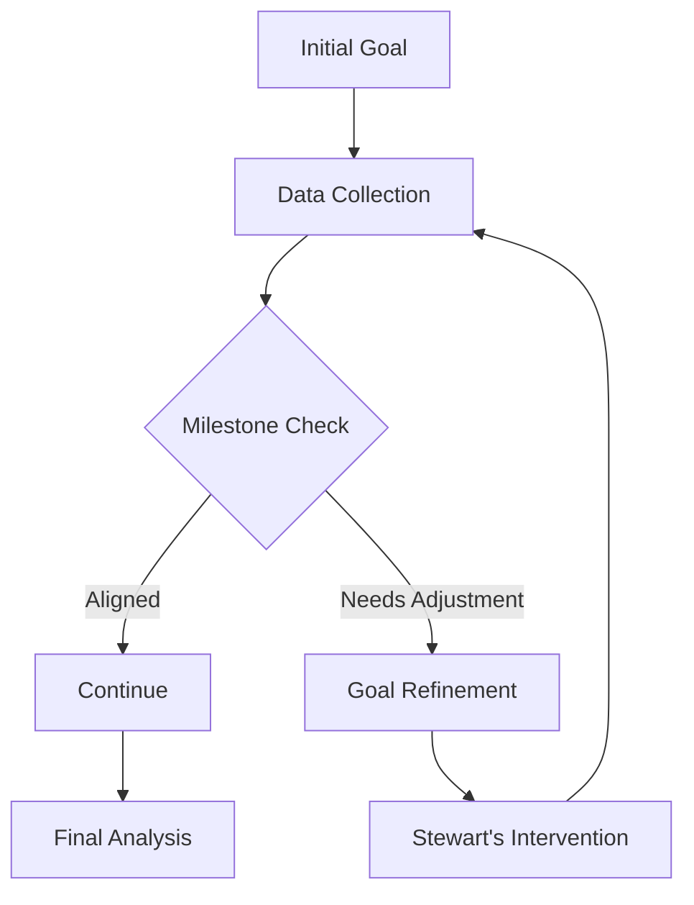
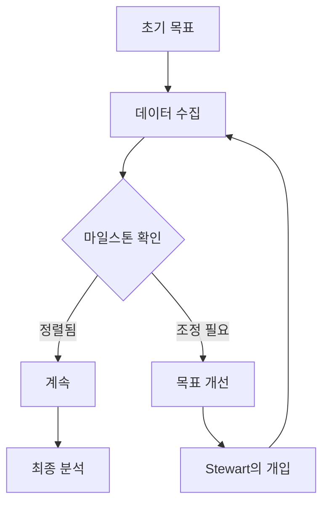

# UMIS-BMAD v5.0

<div align="center">

[](https://github.com/your-org/umis-bmad)
[](LICENSE)
[](https://github.com/your-org/UMIS-framework)

**Universal Market Intelligence System - BMAD Integration**

[한국어](#한국어) | [English](#english)

</div>

---

## English

### 🎯 Overview

UMIS-BMAD v5.0 is an advanced market intelligence system that integrates the Universal Market Intelligence System (UMIS) with the BMAD (Business Market Analysis & Development) methodology. This version introduces groundbreaking Adaptive Intelligence features that revolutionize how market analysis is conducted.

### ✨ What's New in v5.0

#### 🧠 Adaptive Intelligence Edition
- **Progressive Clarification Model**: Dynamically refines goals based on interim results
- **Milestone-Based Decision Points**: Smart checkpoints for strategic pivots
- **Adaptive Workflow Engine**: Self-adjusting processes that learn from data patterns

#### 👁️ Progress Guardian System
- **Stewart's Proactive Monitoring**: Real-time goal alignment tracking
- **Intervention Triggers**: Automated alerts for course corrections
- **Over-focus Prevention**: Warnings against tunnel vision

#### 🛡️ 3-Stage Data Integrity System
1. **Prevention**: Auto-save checkpoints, duplicate protection
2. **Detection**: Integrity verification, completeness checks
3. **Recovery**: Version restoration, data reconstruction

### 🚀 Quick Start

```bash
# Install UMIS-BMAD
curl -O https://raw.githubusercontent.com/your-org/umis-bmad/v5.0-adaptive/install-umis.sh
chmod +x install-umis.sh
./install-umis.sh

# Verify installation
umis --version
# Expected: UMIS-BMAD v5.0.0

# Run your first analysis
umis analyze --mode adaptive --project "my-market-analysis"
```

### 📦 Package Structure

```
UMIS-bmad/
├── bin/                    # Executable scripts
├── lib/                    # Core libraries
│   ├── agents/            # 6 specialized agents
│   ├── frameworks/        # Analysis frameworks
│   └── monitoring/        # v5.0 monitoring systems
├── docs/                  # Documentation
├── install-files/         # Installation resources
└── guidelines/            # UMIS Framework guidelines
```

### 🤖 Six Specialized Agents

1. **MOwner** - Strategic decision maker
2. **MAnalyst (Albert)** - Market structure analyzer
3. **MExplorer (Steve)** - Opportunity explorer
4. **MQuant (Bill)** - Market quantification specialist
5. **MValidator (Rachel)** - Data validation expert
6. **MCurator (Stewart)** - Progress Guardian & data curator

### 📊 Adaptive Workflow



### 🔧 Configuration

Create `umis-config.yaml`:

```yaml
version: 5.0
mode: adaptive
monitoring:
  stewart_alerts: true
  checkpoint_interval: 30m
  integrity_checks: true
data_protection:
  auto_save: true
  versioning: true
  compression: gzip
```

### 📖 Documentation

- [Installation Guide](docs/UMIS-BMAD-Integration-Guide.md)
- [API Reference](docs/api-reference.md)
- [Agent Guidelines](guidelines/)
- [Migration from v4.0](docs/migration-v4-to-v5.md)

---

## 한국어

### 🎯 개요

UMIS-BMAD v5.0은 범용 시장 정보 시스템(UMIS)과 BMAD(비즈니스 시장 분석 및 개발) 방법론을 통합한 고급 시장 정보 시스템입니다. 이 버전은 시장 분석 방식을 혁신하는 획기적인 적응형 인텔리전스 기능을 도입했습니다.

### ✨ v5.0의 새로운 기능

#### 🧠 적응형 인텔리전스 에디션
- **점진적 명확화 모델**: 중간 결과를 기반으로 목표를 동적으로 개선
- **마일스톤 기반 의사결정 포인트**: 전략적 전환을 위한 스마트 체크포인트
- **적응형 워크플로우 엔진**: 데이터 패턴에서 학습하는 자체 조정 프로세스

#### 👁️ 진행 상황 보호자 시스템
- **Stewart의 사전 예방적 모니터링**: 실시간 목표 정렬 추적
- **개입 트리거**: 경로 수정을 위한 자동 알림
- **과도한 집중 방지**: 터널 비전에 대한 경고

#### 🛡️ 3단계 데이터 무결성 시스템
1. **예방**: 자동 저장 체크포인트, 중복 보호
2. **감지**: 무결성 검증, 완전성 검사
3. **복구**: 버전 복원, 데이터 재구성

### 🚀 빠른 시작

```bash
# UMIS-BMAD 설치
curl -O https://raw.githubusercontent.com/your-org/umis-bmad/v5.0-adaptive/install-umis.sh
chmod +x install-umis.sh
./install-umis.sh

# 설치 확인
umis --version
# 예상: UMIS-BMAD v5.0.0

# 첫 번째 분석 실행
umis analyze --mode adaptive --project "내-시장-분석"
```

### 📦 패키지 구조

```
UMIS-bmad/
├── bin/                    # 실행 가능 스크립트
├── lib/                    # 핵심 라이브러리
│   ├── agents/            # 6개의 전문 에이전트
│   ├── frameworks/        # 분석 프레임워크
│   └── monitoring/        # v5.0 모니터링 시스템
├── docs/                  # 문서
├── install-files/         # 설치 리소스
└── guidelines/            # UMIS 프레임워크 가이드라인
```

### 🤖 6명의 전문 에이전트

1. **MOwner** - 전략적 의사결정자
2. **MAnalyst (Albert)** - 시장 구조 분석가
3. **MExplorer (Steve)** - 기회 탐색가
4. **MQuant (Bill)** - 시장 정량화 전문가
5. **MValidator (Rachel)** - 데이터 검증 전문가
6. **MCurator (Stewart)** - 진행 상황 보호자 및 데이터 큐레이터

### 📊 적응형 워크플로우



### 🔧 설정

`umis-config.yaml` 생성:

```yaml
version: 5.0
mode: adaptive
monitoring:
  stewart_alerts: true
  checkpoint_interval: 30m
  integrity_checks: true
data_protection:
  auto_save: true
  versioning: true
  compression: gzip
```

### 📖 문서

- [설치 가이드](docs/UMIS-BMAD-Integration-Guide.md)
- [API 참조](docs/api-reference.md)
- [에이전트 가이드라인](guidelines/)
- [v4.0에서 마이그레이션](docs/migration-v4-to-v5.md)

---

## 🤝 Contributing

We welcome contributions! Please see our [Contributing Guidelines](CONTRIBUTING.md) for details.

## 📄 License

This project is licensed under the MIT License - see the [LICENSE](LICENSE) file for details.

## 🙏 Acknowledgments

- BMAD Orchestrator Team
- UMIS Framework Contributors
- All beta testers and early adopters

## 📞 Support

- **Issues**: [GitHub Issues](https://github.com/your-org/umis-bmad/issues)
- **Discussions**: [GitHub Discussions](https://github.com/your-org/umis-bmad/discussions)
- **Email**: support@umis-bmad.org

---

<div align="center">

**Built with ❤️ by the BMAD Orchestrator Team**

[Website](https://umis-bmad.org) | [Documentation](https://docs.umis-bmad.org) | [Blog](https://blog.umis-bmad.org)

</div>