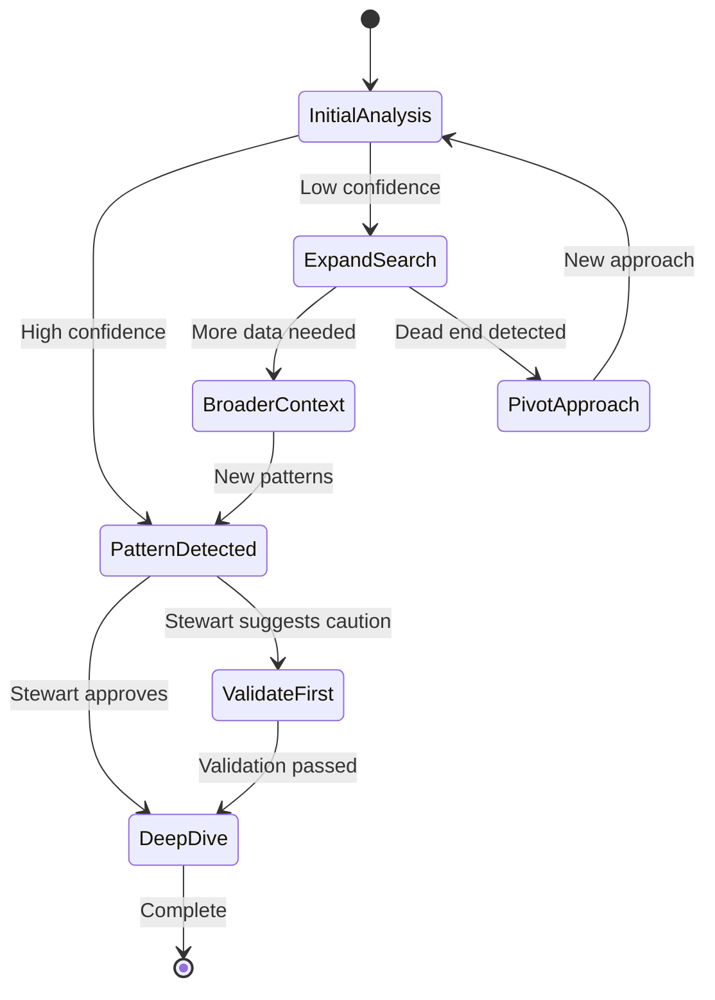

# UMIS-BMAD v5.0 Feature Deep Dive

## 🌟 Adaptive Intelligence Features

### 1. Progressive Clarification Model

The Progressive Clarification Model represents a paradigm shift in how market analysis goals are defined and refined:

```yaml
progressive_clarification:
  initial_phase:
    - broad_goal_definition
    - exploratory_data_collection
    - pattern_identification
  
  refinement_triggers:
    - data_density_threshold: 70%
    - pattern_confidence: 0.8
    - stakeholder_feedback: true
  
  clarification_stages:
    stage_1:
      focus: "Market boundaries"
      methods: ["competitive_landscape", "segment_definition"]
    stage_2:
      focus: "Customer insights"
      methods: ["behavior_analysis", "need_identification"]
    stage_3:
      focus: "Opportunity quantification"
      methods: ["TAM_SAM_SOM", "growth_projection"]
```

### 2. Milestone-Based Decision Points

Strategic checkpoints that enable dynamic course corrections:

```python
class MilestoneManager:
    def __init__(self):
        self.milestones = {
            "data_collection": {
                "completion_criteria": ["coverage > 80%", "quality_score > 0.7"],
                "decision_options": ["proceed", "expand_scope", "pivot"]
            },
            "initial_analysis": {
                "completion_criteria": ["insights_count > 10", "validation_rate > 0.9"],
                "decision_options": ["deepen", "broaden", "finalize"]
            }
        }
    
    def evaluate_milestone(self, milestone_name, current_state):
        # Intelligent evaluation logic
        return decision_recommendation
```

### 3. Stewart's Progress Guardian System

MCurator (Stewart) has evolved into a proactive guardian:

```yaml
stewart_monitoring:
  intervention_triggers:
    - goal_drift_detection:
        threshold: 0.3
        action: "gentle_reminder"
    - over_focus_warning:
        depth_to_breadth_ratio: 5:1
        action: "suggest_perspective_shift"
    - data_loss_risk:
        checkpoint_gap: "2_hours"
        action: "force_checkpoint"
  
  alert_formats:
    gentle_reminder:
      prefix: "📌 Stewart's Note"
      tone: "supportive"
    urgent_intervention:
      prefix: "⚠️ Stewart's Alert"
      tone: "direct"
```

### 4. Three-Stage Data Integrity System

#### Stage 1: Prevention
```bash
# Automatic checkpoint creation
checkpoint_manager:
  frequency: 30m
  triggers:
    - major_data_update
    - workflow_transition
    - manual_request
  storage:
    local: ./checkpoints/
    cloud: s3://umis-backups/
```

#### Stage 2: Detection
```python
def integrity_check():
    checks = [
        verify_file_completeness(),
        validate_data_consistency(),
        check_reference_integrity(),
        monitor_version_conflicts()
    ]
    return IntegrityReport(checks)
```

#### Stage 3: Recovery
```yaml
recovery_options:
  automatic:
    - last_known_good_state
    - incremental_restoration
  manual:
    - selective_file_recovery
    - full_project_restoration
  assisted:
    - stewart_guided_recovery
    - conflict_resolution_wizard
```

## 🔄 Adaptive Workflow Engine

The workflow engine learns and adapts based on:

1. **Data Patterns**
   - Volume and velocity of incoming data
   - Quality metrics and validation rates
   - User interaction patterns

2. **Project Context**
   - Industry specifics
   - Market maturity
   - Analysis objectives

3. **Historical Performance**
   - Previous project outcomes
   - Time-to-insight metrics
   - Accuracy measurements

### Example Adaptive Behavior



## 🛠️ Implementation Examples

### 1. Adaptive Goal Setting
```python
# Initial broad goal
initial_goal = {
    "objective": "Understand hobby market in Korea",
    "scope": "all hobbies with physical components",
    "metrics": ["market_size", "growth_rate", "entry_barriers"]
}

# After progressive clarification
refined_goal = {
    "objective": "Quantify entry market for top 100 hobbies in Korea",
    "scope": {
        "included": ["equipment", "consumables", "learning", "facilities"],
        "excluded": ["digital_only", "collection", "side_business"],
        "focus": "adult_market_only"
    },
    "metrics": {
        "primary": ["annual_new_entrants", "first_month_spending"],
        "breakdown": ["equipment_cost", "learning_cost", "consumables", "facility_fees"],
        "validation": ["4_method_convergence", "±30%_accuracy"]
    }
}
```

### 2. Stewart's Intervention Example
```yaml
intervention_log:
  timestamp: "2024-12-26T10:30:00Z"
  trigger: "over_focus_detection"
  context:
    current_task: "Deep diving into camping equipment specs"
    time_spent: "3 hours"
    breadth_coverage: "15%"
  
  stewart_message: |
    📌 Stewart's Note: Great attention to detail on camping equipment!
    However, we've covered only 15% of our hobby list. 
    
    Consider:
    - Moving to the next hobby category
    - Applying camping insights as a template
    - Setting a timer for deep dives (suggested: 45 min/hobby)
    
    Your thoroughness is valuable - let's apply it broadly! 💪
```

### 3. Data Integrity in Action
```bash
# Automatic checkpoint before major operation
[2024-12-26 10:45] Creating checkpoint: pre_market_sizing_v3.0
[2024-12-26 10:45] Files: 847, Size: 234MB
[2024-12-26 10:45] Integrity hash: sha256:3f4a8b...
[2024-12-26 10:46] Checkpoint complete, proceeding with operation

# Integrity violation detected
[2024-12-26 11:30] ⚠️ Integrity Check Failed
[2024-12-26 11:30] Missing files detected: 3
[2024-12-26 11:30] Stewart's Recovery Assistant activated
[2024-12-26 11:31] Restored from checkpoint: pre_market_sizing_v3.0
[2024-12-26 11:31] ✅ All files recovered successfully
```

## 🎯 Real-World Impact

### Before v5.0 (Rigid Workflow)
- Fixed analysis paths
- Late-stage goal adjustments costly
- Manual progress tracking
- Risk of data loss
- Tunnel vision common

### With v5.0 (Adaptive Intelligence)
- Dynamic goal refinement
- Early course corrections
- Proactive guidance
- Automatic data protection
- Balanced perspective maintained

## 🚀 Getting Started with v5.0 Features

1. **Enable Adaptive Mode**
   ```bash
   umis config set mode adaptive
   umis config set monitoring.stewart true
   ```

2. **Configure Data Protection**
   ```bash
   umis config set checkpoint.auto true
   umis config set checkpoint.interval 30m
   ```

3. **Start Your First Adaptive Project**
   ```bash
   umis create project "My Market Analysis" --adaptive
   ```

4. **Experience Stewart's Guidance**
   - Work naturally on your analysis
   - Stewart will intervene when needed
   - All interventions are logged and learnable

## 📚 Additional Resources

- [Stewart's Intervention Patterns](docs/stewart-patterns.md)
- [Adaptive Workflow Customization](docs/workflow-customization.md)
- [Data Recovery Procedures](docs/data-recovery.md)
- [Migration from v4.0 Workflows](docs/v4-to-v5-migration.md)

---

*"Intelligence that adapts, guidance that protects, analysis that evolves."* - UMIS-BMAD v5.0
